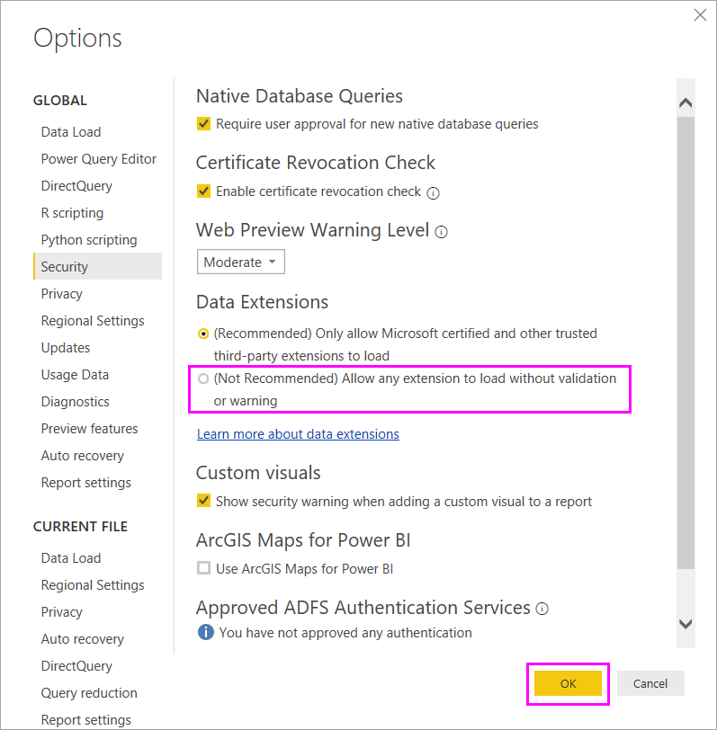
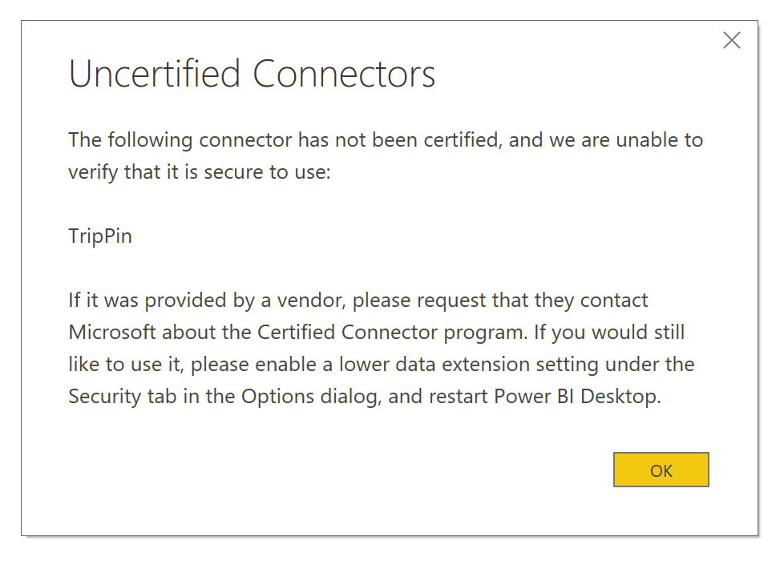

# MariaDB Power BI Connector

## About

**MariaDB** has created a custom **Power BI DirectQuery Connector** which has undergone the **Microsoft** certification process and will be available in the October 2020 release of Microsoft Power BI. In the interim, it is available for download from our website.

## Requirements

*   Microsoft Power BI Desktop
    *   [Download](https://www.microsoft.com/en-us/download/details.aspx?id=58494)

*   MariaDB ODBC Driver v3.1.7 or later
    *   [Download](https://mariadb.com/kb/en/mariadb-connector-odbc/)

*   MariaDB Power BI Connector
    *   [Download](https://mariadb.com/downloads/#connectors-connectors_dataanalysis)

## Connector extensibility in Power BI

Power BI can connect to data by using existing connectors and generic data sources, like ODBC, OData, OLE DB, Web, CSV, XML, and JSON. Or, developers can enable new data sources with custom data extensions called _custom connectors_. Some custom connectors are certified and distributed by Microsoft as _certified connectors_.

To use non-certified custom connectors that you or a third party have developed, you must adjust the Power BI Desktop security settings to allow extensions to load without validation or warning. Because this code can handle credentials, including sending them over HTTP, and ignore privacy levels, you should only use this security setting if you absolutely trust your custom connectors.

Another option is for the developer to sign the connector with a certificate, and provide the information you need to use it without changing your security settings. For more information, see [About trusted third-party connectors](https://docs.microsoft.com/en-us/power-bi/connect-data/desktop-trusted-third-party-connectors).

## Custom connectors
Non-certified custom connectors can range from small business-critical APIs to large industry-specific services that Microsoft hasn't released a connector for. Many connectors are distributed by vendors. If you need a specific data connector, contact the vendor.

To use a non-certified custom connector, put the connector _.pq, .pqx, .m, or .mez_ file in the _[Documents]\Power BI Desktop\Custom Connectors_ folder. If the folder doesn't exist, create it.

Adjust the data extension security settings as follows:

In Power BI Desktop, select **File** > **Options and settings** > **Options** > **Security**.

Under **Data Extensions**, select **(Not Recommended) Allow any extension to load without validation or warning**. Select **OK**, and then restart Power BI Desktop.

The default Power BI Desktop data extension security setting is **(Recommended) Only allow Microsoft certified and other trusted third-party extensions to load**. With this setting, if there are non-certified custom connectors on your system, the **Uncertified Connectors** dialog box appears at Power BI Desktop startup, listing the connectors that can't securely load.

To resolve the error, you can either change your **Data Extensions** security setting, or remove the uncertified connectors from your _Custom Connectors_ folder.

## Certified connectors
A limited subset of data extensions is considered certified. While Microsoft distributes the connectors, it's not responsible for their performance or continued function. The third-party developer who created the connector is responsible for its maintenance and support.

In Power BI Desktop, certified third-party connectors appear in the list in the **Get Data** dialog box, along with generic and common connectors. You don't need to adjust security settings to use the certified connectors.
